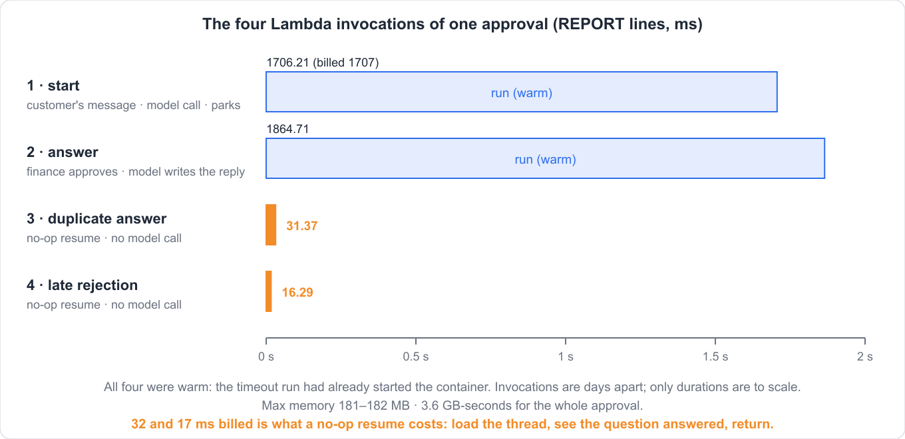

# Externalize agent interrupts for HITL

*Human-in-the-loop for LangGraph on AWS Lambda — the agent stops for a human, the process dies, and the run continues later with no server and no state in your code.*

Every human-in-the-loop tutorial I have read assumes a process that is still running when the human answers. The graph calls `interrupt()`, the notebook prints the question, you type an answer, the run continues. That assumption is doing all the work, and it is the first thing to go in production.

A refund over the limit needs finance. Finance takes days. Lambda gives you fifteen minutes.

This post is four runnable acts and a deadline, in order of what breaks. Two packages do the work, each doing one thing, and neither one imports the other: `langgraph-dynamodb-checkpoint` 0.5.0 makes the parked thread a row, and `agent-wait` 0.7.0 makes the interrupt a message. Everything quoted below is pasted from a real run; the scripts, the logs and the tests are at [github.com/skamalj/agentstate-examples/tree/main/approval-on-lambda](https://github.com/skamalj/agentstate-examples/tree/main/approval-on-lambda).

![End to end: a start message on answers.fifo triggers invocation 1; the agent calls escalate_refund, @wait parks it, the run ends with __interrupt__. DynamoDBSaver writes the parked thread (8 items) and publish_interrupts puts the envelope on questions.fifo and an open row in the approvals table. Then nothing runs for days. Finance reads the envelope, copies reply_with, sets the answer and sends it to answers.fifo; invocation 2 loads the thread back from DynamoDB, resumes, and issues the refund once.](images/whole-flow.png)

That is the finished shape, and the gap in the middle of it — where nothing runs for days — is the whole point. The four acts below build it one failure at a time.

The agent is a LangChain `create_agent` over Claude Sonnet 4.6, with two tools and a limit of ₹25,000. `issue_refund` is ordinary. `escalate_refund` is the same body behind one decorator:

```python
@tool
@wait(FINANCE)
def escalate_refund(order_id: str, amount: int) -> str:
    """Refund an order of more than 25000 rupees. Finance approves before any money moves."""
    return "finance approved; " + _refund(order_id, amount)
```

Two tools rather than one tool with an `if`, because `@wait` is not conditional — it parks *every* call to the function it decorates. Which tool to call is the model's decision, off the tool descriptions and the limit in the system prompt.

Which raises the obvious question, and it is the first one an approvals person asks: what stops the model calling `issue_refund` for ₹41,000? Nothing, if the limit only lives in the prompt. So it does not:

```python
@tool
def issue_refund(order_id: str, amount: int) -> str:
    """Refund an order of 25000 rupees or less. Runs immediately."""
    if amount > APPROVAL_LIMIT:
        return f"refused: {amount} is over the {APPROVAL_LIMIT} approval limit; call escalate_refund"
    return _refund(order_id, amount)
```

The model picks the tool; the tool enforces the limit. A model that picks wrong gets the refusal back as a tool result and calls `escalate_refund` instead — a routing mistake, self-correcting, costing one turn. A model that picks wrong against a prompt-only limit moves ₹41,000 without asking anyone, which is not a mistake, it is an incident.

Hold on to that distinction, because the post makes it twice: a published intention is not an enforced one. Every rule you would be unhappy to see broken has to live somewhere you control — the tool body, or a router node in front of it. The prompt is a hint about which door to knock on, not the lock. The deadline in act 4 is the same argument about a different field, and there you can watch the enforcement happen.

`FINANCE` is what the asker declares about the question. Every field of it gets published and none of it is enforced; that turns out to matter a great deal, and there is a section on it below.

```python
TIMEOUT = os.environ.get("REFUND_WAIT_TIMEOUT", "P3D")

FINANCE = WaitPolicy(
    timeout=TIMEOUT,
    default={"action": "reject", "reason": f"no finance response within {TIMEOUT}"},
    allowed_actions=("approve", "reject"),
    tags={"approver_group": "finance"},
)
```

## Act 1: it vanishes

`InMemorySaver`, a customer asking for ₹41,000 back, and a process that then exits — which on Lambda happens within minutes of the last invocation, and in a container happens on the next deploy.

```text
run 1: parked on 1 question(s)
  question_id=3b6bc3d4a85dd6eae5c25a01c4c45191
  value={'question': {'function': 'escalate_refund', 'args': {'order_id': 'order-4471', 'amount': 41000}}, ...}
run 1: refunds issued = []

--- interpreter exits here ---

run 2: messages on the thread: 1
run 2: agent says: Hello! I'm the refunds agent for our online store. How can I help you today?
run 2: refunds issued = []
```

Run 2 is a fresh interpreter, the same `thread_id`, and finance's approval passed in as `Command(resume={question_id: {"action": "approve"}})`. It does not raise. It does not say "I don't know that thread". It greets the customer, because to LangGraph this is a brand-new conversation with an empty checkpoint and a resume value nobody asked for.

The refund never happens, the customer is never told, and nothing anywhere logs an error. That is the failure mode you are actually designing against.

There is a wall in this system, and act 1 fails because everything it needs is on the wrong side of it. The picture below is that wall: the graph run, the interrupt value, the saver and the side-effect list all live in a process that is about to end; the tables and the queues outlive it. The next two acts are about carrying two things across — the thread, then the question.


## Act 2: the parked thread survives

One line changes.

```python
from langgraph_dynamodb_checkpoint import DynamoDBSaver

saver = DynamoDBSaver(TABLE)          # creates the table if it is not there
agent = refund.build_agent(saver)
```

`langgraph-dynamodb-checkpoint` 0.5.0 creates the table if it is missing — `PAY_PER_REQUEST`, waits until it is active — so this act needs no setup at all. (In a locked-down Lambda role that cannot call `CreateTable`, you pre-create it; the stack in act 4 does.)

The demo runs the graph in child interpreters, so "the process died" is a process exit and not a comment. One child parks. It exits. The parent then queries DynamoDB on `PK = thread_id` and prints what exists at that moment:

```text
  [pid 36816] parked on 1 question(s)
  [pid 36816] question    = {'function': 'escalate_refund', 'args': {'order_id': 'order-4471', 'amount': 41000}}
  [pid 36816] refunds issued this process: []

--- interpreter 1 is gone. What is in DynamoDB right now ---

Query on PK='order-4471-a2d5f9f5': 8 items
  checkpoint SK='1f1b8445-fd5b-612b-bfff-132d24fb0073'   type='msgpack', 384 bytes
  checkpoint SK='1f1b8445-fd6e-68ce-8000-4f45a6520f3d'   type='msgpack', 700 bytes
  checkpoint SK='1f1b8446-0bf9-691b-8001-4ad87d4d2ba8'   type='msgpack', 2172 bytes
  writes     SK='...-fd5b-...$50ff9cca-...$0'            channel='messages', 116 bytes
  writes     SK='...-fd5b-...$50ff9cca-...$1'            channel='branch:to:model', 0 bytes
  writes     SK='...-fd6e-...$41ebf892-...$0'            channel='messages', 1240 bytes
  writes     SK='...-fd6e-...$41ebf892-...$1'            channel='__pregel_tasks', 188 bytes
  writes     SK='...-0bf9-...$4751462b-...$-3'           channel='__interrupt__', 496 bytes
```

Three checkpoints, one per super-step, and five pending writes hanging off them — the tree below draws the parentage those sort keys encode, on one table with no GSI anywhere in it.

The pending writes are the part that matters. The last leaf on that tree, `channel='__interrupt__'`, 496 bytes, *is* the parked question. A checkpointer that wrote only checkpoints would lose it, and a resume from a cold process would re-run the node from a state that does not know it ever asked. The package loads them back into `CheckpointTuple.pending_writes`, which is what makes cross-process interrupt and resume work at all; its author reports it passing LangGraph's conformance suite at `FULL` against a live table. Every read in the resume path is a `ConsistentRead`.


Then a second child interpreter — new pid, new everything — resumes the same thread:

```text
--- interpreter 2: finance answers, three days later ---
  [pid 11804] refunds issued this process: ['order-4471']
  [pid 11804] agent says: Great news — Finance has approved and processed a refund of
              ₹41,000 for order order-4471.

items after the resume: 14 (was 8)
```

The refund ran in a process that did not exist when the question was asked. Setup and IAM for the checkpointer are at [skamalj.github.io/agentstate-reducer/langgraph/dynamodb](https://skamalj.github.io/agentstate-reducer/langgraph/dynamodb/); I will not restate them here.

## Act 3: but the question is trapped

Act 2 fixed durability and nothing else. The checkpoint knows the graph is waiting. Nobody else does — not the finance team, not an approvals dashboard, not a Slack channel. There is no event, no row, no message. Somebody has to go and ask LangGraph.

The `@wait` decorator has been on the tool since act 1, and on its own it does exactly one thing: it shapes the interrupt value into `{"function": ..., "args": {...}}` and attaches the policy to it. It does not tell anybody. That is the other half of [`agent-wait` 0.7.0](https://skamalj.github.io/agent-wait/), one call after the run:

```python
announce = [SqsAnnounce(os.environ["REFUND_QUESTIONS_QUEUE"]), DynamoDbAnnounce(APPROVALS)]
...
result = agent.invoke(value, config)
publish_interrupts(result, thread_id, announce)
```

`publish_interrupts` reads `result["__interrupt__"]` and nothing else. No graph handle, no `get_state()`, no checkpointer — it never touches the thing act 2 built. If nothing interrupted, it does nothing.

Here is the whole envelope that landed on the queue:

```json
{
  "type": "wait.created",
  "event_id": "01M3AA94A3CG2QR8V8X7HV5E10",
  "thread_id": "order-4471-0db3659a",
  "question_id": "2a54b5108aeffb7eea7d66df74ca16d8",
  "question": {
    "function": "escalate_refund",
    "args": { "order_id": "order-4471", "amount": 41000 }
  },
  "allowed_actions": ["approve", "reject"],
  "expires_at": "2026-09-27T18:19:10Z",
  "default": { "action": "reject", "reason": "no finance response within P3D" },
  "answer_ttl": null,
  "source": { "function": "escalate_refund" },
  "reply_to": null,
  "reply_with": {
    "thread_id": "order-4471-0db3659a",
    "question_id": "2a54b5108aeffb7eea7d66df74ca16d8",
    "answer": null
  },
  "correlation": null,
  "tags": { "approver_group": "finance" }
}
```

`question_id` is LangGraph's own `Interrupt.id`, which is why a republished question keeps its identity. `reply_with` is a filled-in stub: copy it, set `answer`, send it back — the only empty field in the whole document, as the grouping below makes plain.


The same call also wrote the question as a row, because `DynamoDbAnnounce` was in the list — `pk = THREAD#<thread>`, `sk = WAIT#<question_id>`, `status = "open"`, and a `by_status` GSI so a dashboard can query "everything still open, oldest deadline first" without building a projection off a queue. One call, two places: the queue that wakes someone, and the row an operator reads.

The return leg is one `if`, and it is the only integration code in the whole demo:

```python
if "question_id" in message:  # an answer
    value = Command(resume={str(message["question_id"]): message.get("answer")})
else:  # a start
    value = message.get("input")
```

Finance approves. A new interpreter picks the answer off the answers queue and resumes:

```text
--- host run 2: the answer arrives, in a new interpreter ---
  [pid 32708] refunds issued this process: ['order-4471']
```

Then the interesting part. The same answer is delivered a second time, and then a *different* answer arrives late:

```text
--- the same answer arrives a second time ---
  [pid 29200] refunds issued this process: []

--- and a different answer, after the fact ---
  [pid 22404] refunds issued this process: []

refunds recorded in DynamoDB for order-4471, across all four runs: 1
```

Nothing ran either time. A `Command(resume=...)` for a question the thread has already moved past is a no-op in LangGraph, so the host needs no ledger, no idempotency key and no check. The first decision stands. The counter is an unconditional `ADD calls :one` in DynamoDB rather than a Python list, precisely so "it ran once" is a fact outside any process.

## Act 4: deployed

Same `graph.py`, same host `if`, on Lambda. The approve path drawn below is two FIFO queues, one function and three tables — the third being the refund counter, which exists only so the demo can prove what happened.

What is worth noticing is what neither package asked for. No wait store, no sweeper, no scheduler: they keep no state of their own, so nothing has to run on their behalf between the question going out and the answer coming back. That is a claim about what the libraries require, not a promise that your stack will stay this small — the next section adds a scheduler on purpose, and the claim survives it.


A script on my laptop plays the customer and then finance. It never imports the agent; it only puts JSON on a queue and reads JSON off another one.

```text
--- the customer's message is on the queue; nothing of ours is running ---
question arrived after 7.1s
```

That 7.1 seconds is SQS delivery plus a cold start plus a model call. Here is what the function logged for the whole approval, with request ids stripped:

```text
agent-wait {"event": "wait.created", "thread_id": "order-d07f6e", "question_id": "55e4d599d8dab3ac351f504b7f35a3e7",
            "allowed_actions": ["approve", "reject"], "expires_at": "2026-09-25T05:42:01Z",
            "tags": {"approver_group": "finance"}}
{"thread_id": "order-d07f6e", "kind": "start",  "parked_on": ["55e4d599..."], "refunds_by_this_container": [], "reply": ""}
REPORT Duration: 1706.21 ms  Billed Duration: 1707 ms  Max Memory Used: 181 MB

{"thread_id": "order-d07f6e", "kind": "answer", "parked_on": [], "refunds_by_this_container": ["order-d07f6e"],
 "reply": "Great news! Finance has approved your refund of ₹41,000 for order order-d07f6e."}
REPORT Duration: 1864.71 ms  Billed Duration: 1865 ms  Max Memory Used: 182 MB

{"thread_id": "order-d07f6e", "kind": "answer", "parked_on": [], "refunds_by_this_container": ["order-d07f6e"], ...}
REPORT Duration: 31.37 ms  Billed Duration: 32 ms  Max Memory Used: 182 MB

{"thread_id": "order-d07f6e", "kind": "answer", "parked_on": [], "refunds_by_this_container": ["order-d07f6e"], ...}
REPORT Duration: 16.29 ms  Billed Duration: 17 ms  Max Memory Used: 182 MB
```

Four invocations, and on one scale below they are two tall bars and two slivers. The first is the customer's message, 1.7 seconds. The second is finance's approval, 1.9 seconds, including the model call that writes the reply. The third and fourth are the duplicate and the late rejection: **32 and 17 milliseconds**. That is what a no-op resume costs — load the thread from DynamoDB, see the question has been answered, return. No model call, because nothing ran, which is why the last two bars barely exist. None of the four shows an init duration: the deadline run below went first on the same function, so the container was already warm. Only the durations are to scale; in wall-clock time those four bars are days apart.



`refunds_by_this_container` says `["order-d07f6e"]` on all three answers, and that is not a bug in the demo. It is a module-level Python list, and Lambda reused the container, so it holds everything that container has ever refunded. The number that means something is the counter in DynamoDB, which is why the counter is in DynamoDB:

```text
open questions in the approvals table (GSI by_status): 1
refunds recorded so far: 0

--- finance approves, three days later as far as anything here knows ---
refunds recorded after the approval: 1
rows for this thread still status=open after the refund: 1

--- the same answer twice more ---
refunds recorded after three answers in total: 1
further questions published for this thread: 0
```

Read the third line again. The refund has been approved, the money has moved, and the row in the approvals table still says `status = "open"`. `DynamoDbAnnounce` writes that row once and never touches it again, on purpose — it is not on the receive path and cannot know the question was answered. Point a dashboard straight at that table and it will show finance a question they already approved, with a live-looking Approve button on it. Closing the row is the host's job; this host does not do it, and nothing warned me. Worth knowing before that table becomes a queue somebody works from.

The whole approval billed 3.6 GB-seconds of Lambda, four requests, a handful of DynamoDB writes and eight SQS messages. Between the question going out and the answer coming back, that cost is zero: no process, no polling loop, no scheduled sweep. The thread is a few rows and the question is a message.

## The deadline, enforced

Which brings us to the thing act 4 just said nobody needs.

`FINANCE` declares `timeout="PT2M"` on the deployed stack — three days is the real policy, two minutes is what a blog post can wait for — and `agent-wait` publishes it as `expires_at` and does nothing about it. That is the division of labour, not a gap: `expires_at` and `default` are machine-readable so that something else can act on them with no human and no agent code involved.

Here that something else is a second Lambda on a second queue — one of four destinations the same `publish_interrupts` call already writes to, and the only one no human reads:

```python
ANNOUNCE = [
    LogAnnounce(),
    SqsAnnounce(os.environ["REFUND_QUESTIONS_QUEUE"]),   # a person reads this
    SqsAnnounce(os.environ["REFUND_TIMEOUTS_QUEUE"]),    # a scheduler reads this
    DynamoDbAnnounce(os.environ["REFUND_APPROVALS_TABLE"]),
]
```

That function asks EventBridge Scheduler for a one-shot delivery of the policy's own `default`, at `expires_at`, to the queue the agent listens on. It knows nothing about LangGraph, checkpoints or refunds — one JSON document in, one schedule out:

```python
scheduler.create_schedule(
    Name=f"refund-timeout-{envelope['question_id'][:24]}",
    ScheduleExpression=f"at({expires_at.rstrip('Z')})",
    ActionAfterCompletion="DELETE",
    Target={"Arn": ANSWERS_QUEUE_ARN, "RoleArn": SCHEDULER_ROLE,
            "Input": json.dumps(answer_for(envelope)), ...},
)
```

`answer_for` invents nothing: it copies the envelope's `reply_with` stub — the pre-filled reply agent-wait publishes for exactly this purpose — and drops `default` into the `answer` field. What the deadline sends is byte for byte what a human sends by clicking reject.

Two details in that call are load-bearing. The name is derived from `question_id`, so arming the timer is idempotent — a republished envelope asks for a schedule that already exists, gets `ConflictException`, and is dropped. One question, one timer, however many times it is announced. And `DELETE` means the schedule reaps itself, so there is no sweeper and nothing accumulates.

Here is a run where nobody answers:

```text
question arrived after 2.4s
question_id : 95e310aa4663f0ec685aa1575fef07b4
expires_at  : 2026-09-25T05:39:55Z
default     : {"action": "reject", "reason": "no finance response within PT2M"}

--- what the consumer created, before it fires ---
{
  "Name": "refund-timeout-95e310aa4663f0ec685aa157",
  "ScheduleExpression": "at(2026-09-25T05:39:55)",
  "ScheduleExpressionTimezone": "UTC",
  "ActionAfterCompletion": "DELETE",
  "Target": {
    "Arn": "...:approval-on-lambda-Answers...fifo",
    "SqsParameters": { "MessageGroupId": "order-5ed76d" },
    "Input": {
      "thread_id": "order-5ed76d",
      "question_id": "95e310aa4663f0ec685aa1575fef07b4",
      "answer": { "action": "reject", "reason": "no finance response within PT2M" }
    }
  }
}

refunds recorded while it waits: 0
open rows for this thread       : 1

--- waiting 211s for the deadline; no process of ours is running ---
the schedule fired and deleted itself (ActionAfterCompletion=DELETE)
the agent resumed at 05:40:13Z, 18s after expires_at

refunds recorded after the deadline: 0
```

Eighteen seconds late, printed rather than rounded away: Scheduler is minute-granular, and that gap is delivery, not drift. The customer got a sentence rather than silence — *"could not be processed at this time, as it requires finance approval and no response was received within the allotted time"* — because the reject travelled the graph as an ordinary answer and the model wrote the reply it always writes.

Then the human turns up late and approves:

```text
--- a human approves, too late ---
refunds recorded after the late approval: 0
```

Nothing runs, and not because the timeout installed a guard: it is the same no-op as a duplicate approval on the happy path, the thread having moved past the question. The deadline did not win a race with the human. It answered first, and after that there was nothing left to answer.

End to end, with the waiting drawn to scale, it looks like this.

![The deadline end to end on thread order-5ed76d: the start invocation parks and publishes the same envelope to questions.fifo and timeouts.fifo. The scheduler Lambda creates a one-shot schedule named refund-timeout-95e310aa4663f0ec685aa157 with at(2026-09-25T05:39:55), ActionAfterCompletion DELETE, targeting answers.fifo with MessageGroupId order-5ed76d and the envelope's default as the answer. For 211 s no process runs. At expires_at 2026-09-25T05:39:55Z nothing fires; at 05:40:13Z, 18 s later, the schedule delivers the default and deletes itself, the agent resumes and rejects, refunds recorded 0. A late human approval is a no-op, refunds still 0.](images/timeout-sequence.png)

**The claim this section has to defend.** Act 4 said that between the question going out and the answer coming back there is no process at all, and a timer looks like a process. It is not one, and the long empty stretch in the middle of that picture is the point: the schedule is a row in AWS, with no container, no polling loop and nothing billed while it waits. The scheduler Lambda ran once, at question time — the schedule existed before the deadline, which is how we printed it — and then stopped. The timer is not an exception to the claim. It is the claim, applied to the deadline as well as to the agent.

**And the thing that nearly ate this section.** The first deployed attempt failed in the worst way available: the schedule was created correctly, fired on time and deleted itself, and the agent never resumed. A FIFO queue rejects a `SendMessage` carrying no `MessageDeduplicationId` unless content-based deduplication is on, and Scheduler's `SqsParameters` can set `MessageGroupId` and nothing else. The delivery was refused — and from Scheduler's side the invocation had been made, so it reported success and tidied the schedule away. A deadline that silently never arrives, a question that waits for ever, and the evidence already deleted. The fix is one property, `content_based_deduplication=True` on the answers queue; it changes nothing for the other senders, because an explicit deduplication id takes precedence over the content hash.

Be precise about why nothing caught it. The answers queue has a dead-letter queue and it could never have helped: a DLQ catches messages that arrived and failed to process, and this was a send rejected before anything entered the queue. What catches it is a `DeadLetterConfig` on the *schedule's target* — which is why there is one, and why the run prints it:

```text
undelivered schedules on the schedule dead-letter queue: 0
```

Below, the same delivery twice: on the left it is refused and everything downstream still looks healthy, on the right one queue property changes and the agent wakes up.

![Left, the first deployed attempt: the schedule fires and sends with MessageGroupId only; the FIFO answers queue rejects a send with no MessageDeduplicationId; Scheduler still reports success and deletes the schedule; nothing entered the queue so the answers dead-letter queue never sees it; the agent never resumes and the evidence is gone. Right, the fix: content_based_deduplication=True on the answers queue, so the send is accepted and the agent resumes, plus a DeadLetterConfig on the schedule's target where a refused delivery would land; the run prints undelivered schedules on the schedule dead-letter queue: 0.](images/timeout-silent-failure.png)

**Why FIFO on every leg.** Outbound, `SqsAnnounce` sets `MessageDeduplicationId` to the envelope's `dedupe_key` (`wait.created:<question_id>`, stable across republishes), so a redelivered start message that republishes the same question is swallowed by the queue itself. Inbound, `MessageGroupId = thread_id` serialises answers for one thread — and with a deadline in play that stops being hypothetical, because a human clicking approve and a schedule firing are exactly two answers that can arrive at once. On a standard queue they would be two Lambdas resuming the same checkpoint. LangGraph would ignore the loser anyway, so this is not correctness; it is not paying for a race you can decline. The deduplication window is five minutes, not a ledger — for anything longer, `dedupe_key` is what a consumer deduplicates on.

That announcer list is where fan-out lives, and this section is one instance of it: two of those four entries are consumers with nothing in common. `SnsAnnounce` turns the policy's `tags` into message attributes, so a subscription filter routes `approver_group = finance` one way and everything else another, without the agent knowing either exists. `EventBridgeAnnounce` puts it on a bus where rules split one question across Slack, a ticket and an audit log. `WebhookAnnounce` is a signed POST, in the stdlib. Anywhere else — Kinesis, Kafka, a Slack client, a Redis key — is a `BaseAnnounce` subclass with one method; those are the dimmed boxes below, and the distance between them and the shipped ones is that one method. Still one `publish_interrupts` call.


## What each package will not do for you

`langgraph-dynamodb-checkpoint`: one item holds the whole serialized checkpoint, so DynamoDB's 400 KB item limit is the ceiling on your state — and on an unbounded message list. Every local run log in this project carries the package's own INFO line about that, once per process; the Lambda sets `AGENTSTATE_QUIET=1`. `delete_for_runs` is a filtered `Scan` and only finds items written by 0.5.0 or later. `prune(strategy="keep_latest")` is not `DeltaChannel`-aware. The async API is executor-backed rather than native `aioboto3`.

One more, because it is the trap that pairs with the deadline above. `DynamoDBSaver(ttl_seconds=...)` stamps a `ttl` on every item it writes, and DynamoDB deletes them whether or not a question about that thread is still open. That deadline *is* enforced, by AWS, and it can silently undercut the advisory one you published: set `ttl_seconds` to a day and a `timeout` of three, and an approval arriving on day two resumes a thread that no longer exists — which is act 1 again, arrived at from the other direction, and with an operator looking at a dashboard that still promises three days. The safe default is not to set `ttl_seconds` at all on a table holding threads parked on humans.

`agent-wait`: it never receives an answer, so `expires_at`, `default`, `answer_ttl` and `allowed_actions` are all published and none of them are enforced. `DynamoDbAnnounce` is an unconditional `put_item`, so a host that treats the row as a ledger — open, answered, closed — has to read it and skip republishing itself; the adapter will not do that read, on purpose. And on langgraph 1.2.x there is one `interrupt()` per node, so each waiting tool needs its own node.

## What's next

The 400 KB ceiling is a real one for a long-lived thread. The same checkpointer takes a `reducer=` that bounds the message list inside the save, and an `on_prune` hook that hands the messages leaving the window to long-term memory instead of dropping them — which is a different post, and is written up at [skamalj.github.io/agentstate-reducer/reducer/long-term-memory](https://skamalj.github.io/agentstate-reducer/reducer/long-term-memory/).

## Reproduce it

```bash
git clone https://github.com/skamalj/agentstate-examples
cd agentstate-examples/approval-on-lambda
uv venv -p 3.12 && uv sync --all-groups
export AWS_PROFILE=<your profile> AWS_DEFAULT_REGION=ap-south-1
uv run python act1_vanishes.py
uv run python act2_survives.py
uv run python act3_asks.py
uv run python two_clocks.py
uv run pytest -q
```

Act 4 is a `uv pip install --target` for the Lambda runtime and a `cdk deploy`; the README has the exact commands, the IAM the role ends up with, and the `cdk destroy` that removes it. No docker anywhere, including for the bundle.

The model is real Bedrock. DynamoDB and SQS are not: acts 2, 3 and the two-clocks run point `AWS_ENDPOINT_URL_DYNAMODB` and `AWS_ENDPOINT_URL_SQS` at a local `moto_server`, so nothing is created in your account and there is nothing to clean up. Set those variables at DynamoDB Local, or empty them for the real services, and the same scripts run there.

Ten tests, all of them about the claims above: the run parks instead of refunding, a *different* process resumes it, the refund runs exactly once across three answers, a duplicate answer runs nothing, the envelope carries the documented fields, the question is also a row, the policy's `default` is an ordinary answer, an under-limit refund asks nobody, `ttl_seconds` stamps every parked item, and the approval limit is enforced by the tool rather than by the prompt.

```text
..........                                                               [100%]
10 passed in 68.31s (0:01:08)
```

## The point

The interrupt is the easy part — LangGraph ships it. What makes it useless on serverless is that the framework stops exactly there: the question exists only inside a process that is about to die, and nothing else in your system can see it or answer it.

Two problems, two packages, neither one aware of the other. Make the parked thread a row, and the process may die. Make the interrupt a message, and someone outside the process can answer it. Then the agent waits for three days without waiting for anything, because nothing is running.
