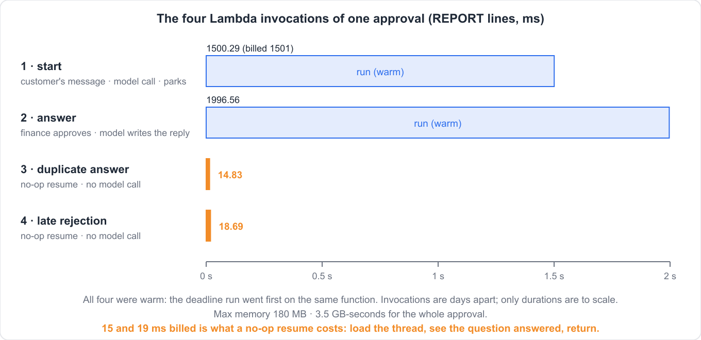

# Externalize agent interrupts for HITL

*Human-in-the-loop for LangGraph on AWS Lambda. The agent stops for a human, the process dies, and the run continues later, with no server and no state in your code.*

Human-in-the-loop tutorials assume a process that is still running when the human answers: the graph calls `interrupt()`, you type an answer, the run continues. That assumption is the first thing you lose in production.

A refund over the limit needs finance. Finance takes days. Lambda gives you fifteen minutes.

Two packages do the work. `langgraph-dynamodb-checkpoint` 0.5.0 makes the parked thread a row. `agent-wait` 0.8.0 makes the interrupt a message. Neither imports the other. Every number and log line below is from a real run, and the scripts, logs and tests are at [github.com/skamalj/agentstate-examples/tree/main/approval-on-lambda](https://github.com/skamalj/agentstate-examples/tree/main/approval-on-lambda).

![End to end: a start message on answers.fifo triggers invocation 1; the agent calls issue_refund, @wait parks it, the run ends with __interrupt__. DynamoDBSaver writes the parked thread (8 items) and publish_interrupts puts the envelope on questions.fifo and an open row in the approvals table. Then nothing runs for days. Finance reads the envelope, copies reply_with, sets the answer and sends it to answers.fifo; invocation 2 loads the thread back from DynamoDB, resumes, and issues the refund once.](images/whole-flow.png)

The gap in the middle, where nothing runs for days, is the part that needs building. Four steps and a deadline, in the order things break.

The agent is a LangChain `create_agent` over Claude Sonnet 4.6, with one tool and a limit of ₹25,000. The limit is a predicate on the decorator:

```python
@tool
@wait(FINANCE, when=lambda order_id, amount: amount > APPROVAL_LIMIT)
def issue_refund(order_id: str, amount: int) -> str:
    """Refund an order. Refunds over 25000 rupees need finance to approve first."""
    REFUNDS_ISSUED.append(order_id)
    return f"refunded {amount} for {order_id}"
```

Under the limit the body runs and nobody is asked. Over it, the call parks. Three things about the predicate, all of which matter in practice: it sees the published `args`, so what you branch on is what the approver reads; it is called again when the node re-runs on resume, so it has to be deterministic on the same arguments; and if it raises, the call parks anyway, because a refund should not go through unasked because a lambda had a typo.

The rule is in code, in one place, and no model decides whether it applies. That distinction is the spine of this post: a published intention is not an enforced one, and anything you would be unhappy to see broken has to live somewhere you control.

`FINANCE` is what the asker declares. Every field is published and none is enforced:

```python
TIMEOUT = os.environ.get("REFUND_WAIT_TIMEOUT", "P3D")

FINANCE = WaitPolicy(
    timeout=TIMEOUT,
    default={"action": "reject", "reason": f"no finance response within {TIMEOUT}"},
    allowed_actions=("approve", "reject"),
    tags={"approver_group": "finance"},
)
```

## Step 1: it vanishes

`InMemorySaver`, a customer asking for ₹41,000 back, and a process that exits. On Lambda that happens within minutes of the last invocation. In a container it happens on the next deploy.

```text
run 1: parked on 1 question(s)
  question_id=f20790e1bb90795863382d749ab65172
  value={'question': {'function': 'issue_refund', 'args': {'order_id': 'order-4471', 'amount': 41000}}, ...}
run 1: refunds issued = []

--- interpreter exits here ---

run 2: messages on the thread: 1
run 2: agent says: Hello! How can I help you today?
run 2: refunds issued = []
```

Run 2 is a fresh interpreter with the same `thread_id`, and finance's approval passed in as `Command(resume={question_id: {"action": "approve"}})`. It does not raise. It greets the customer, because to LangGraph this is a new conversation with an empty checkpoint and a resume value nobody asked for.

The refund never happens, the customer is never told, and nothing logs an error. That is the failure to design against.

Two things have to cross out of that dying process: the thread, then the question. That is steps 2 and 3.


## Step 2: the parked thread survives

One line changes.

```python
from langgraph_dynamodb_checkpoint import DynamoDBSaver

saver = DynamoDBSaver(TABLE)          # creates the table if it is not there
agent = refund.build_agent(saver)
```

`langgraph-dynamodb-checkpoint` 0.5.0 creates the table if it is missing, `PAY_PER_REQUEST`, and waits until it is active, so this step needs no setup. A Lambda role that cannot call `CreateTable` needs it pre-created, which is what the stack in step 4 does.

The demo runs the graph in child interpreters, so the process really exits. One child parks and exits; the parent then queries DynamoDB on `PK = thread_id`:

```text
  [pid 28932] parked on 1 question(s)
  [pid 28932] question_id = 048c1fc9bae482cf1776509f8e0fe530
  [pid 28932] question    = {'function': 'issue_refund', 'args': {'order_id': 'order-4471', 'amount': 41000}}
  [pid 28932] refunds issued this process: []

--- interpreter 1 is gone. What is in DynamoDB right now ---

Query on PK='order-4471-a8aad5a8': 8 items
  checkpoint SK='1f1ba728-2742-61dd-bfff-bb2ad2ad9981'
             type='msgpack', 384 bytes, ttl=-
  checkpoint SK='1f1ba728-2758-633f-8000-354836cf8ecf'
             type='msgpack', 700 bytes, ttl=-
  checkpoint SK='1f1ba728-36f4-6cb6-8001-5a29b68236c1'
             type='msgpack', 2232 bytes, ttl=-
  writes     SK='1f1ba728-2742-61dd-bfff-bb2ad2ad9981$295f47d1-a96a-8c7d-00e1-0db46e932354$0'
             channel='messages', 116 bytes, ttl=-
  writes     SK='1f1ba728-2742-61dd-bfff-bb2ad2ad9981$295f47d1-a96a-8c7d-00e1-0db46e932354$1'
             channel='branch:to:model', 0 bytes, ttl=-
  writes     SK='1f1ba728-2758-633f-8000-354836cf8ecf$cef9638d-3ac8-0f86-4e27-c84053a9d784$0'
             channel='messages', 1304 bytes, ttl=-
  writes     SK='1f1ba728-2758-633f-8000-354836cf8ecf$cef9638d-3ac8-0f86-4e27-c84053a9d784$1'
             channel='__pregel_tasks', 184 bytes, ttl=-
  writes     SK='1f1ba728-36f4-6cb6-8001-5a29b68236c1$4220f82b-d6a7-53b7-12c0-9836f95c294f$-3'
             channel='__interrupt__', 488 bytes, ttl=-
```

Three checkpoints, one per super-step, and five pending writes hanging off them. The tree below draws the parentage those sort keys encode: one table, no GSI.

The pending writes matter more than the checkpoints. The last leaf, `channel='__interrupt__'`, 488 bytes, is the parked question. A checkpointer that wrote only checkpoints would lose it, and a resume from a cold process would re-run the node from a state that does not know it ever asked. The package loads them back into `CheckpointTuple.pending_writes`. Its author reports it passing LangGraph's conformance suite at `FULL` against a live table. Every read in the resume path is a `ConsistentRead`.


A second child interpreter, new pid, resumes the same thread:

```text
--- interpreter 2: finance answers, three days later ---
  [pid 30460] refunds issued this process: ['order-4471']
  [pid 30460] agent says: Since the refund amount exceeds ₹25,000, it has been sent to the finance team for approval before being processed to your account.

items after the resume: 14 (was 8)
```

The refund ran in a process that did not exist when the question was asked. Setup and IAM for the checkpointer are at [skamalj.github.io/agentstate-reducer/langgraph/dynamodb](https://skamalj.github.io/agentstate-reducer/langgraph/dynamodb/).

## Step 3: but the question is trapped

Step 2 fixed durability and nothing else. The checkpoint knows the graph is waiting; nothing else does. No event, no row, no message.

`@wait` has been on the tool since step 1, and on its own it does one thing. It shapes the interrupt value into `{"function": ..., "args": {...}}` and attaches the policy. It tells nobody. That is the other half of [`agent-wait` 0.8.0](https://skamalj.github.io/agent-wait/), one call after the run:

```python
announce = [SqsAnnounce(os.environ["REFUND_QUESTIONS_QUEUE"]), DynamoDbAnnounce(APPROVALS)]
...
result = agent.invoke(value, config)
publish_interrupts(result, thread_id, announce)
```

`publish_interrupts` reads `result["__interrupt__"]` and nothing else. No graph handle, no `get_state()`, no checkpointer. If nothing interrupted, it does nothing. Here is the envelope that landed on the queue:

```json
{
  "type": "wait.created",
  "event_id": "01M3HEX4REKTAXV95YVQQ08BXC",
  "thread_id": "order-4471-ebca9020",
  "question_id": "e03c97a8baf667b7565d85a9ef17a87a",
  "question": {
    "function": "issue_refund",
    "args": {
      "order_id": "order-4471",
      "amount": 41000
    }
  },
  "allowed_actions": [
    "approve",
    "reject"
  ],
  "expires_at": "2026-09-30T12:54:41Z",
  "default": {
    "action": "reject",
    "reason": "no finance response within P3D"
  },
  "answer_ttl": null,
  "source": {
    "function": "issue_refund"
  },
  "reply_to": null,
  "reply_with": {
    "thread_id": "order-4471-ebca9020",
    "question_id": "e03c97a8baf667b7565d85a9ef17a87a",
    "answer": null
  },
  "correlation": null,
  "tags": {
    "approver_group": "finance"
  }
}
```

`question_id` is LangGraph's own `Interrupt.id`, so a republished question keeps its identity. `reply_with` is a filled-in stub: copy it, set `answer`, send it back.

![The envelope field by field, in four groups: identity (event_id, thread_id, question_id = LangGraph's Interrupt.id), the question shaped by @wait (issue_refund, order-4471, 41000), the policy fields that are published but not enforced (allowed_actions, expires_at, default, answer_ttl, tags), and reply_with, a pre-filled reply whose only empty field is answer. Finance copies it, sets the answer and sends it to answers.fifo, where the host's one if turns it into Command(resume). A timeout is the same shape: send envelope.default as the answer.](images/envelope.png)

`DynamoDbAnnounce` was in the same list, so the question is also a row: `pk = THREAD#<thread>`, `sk = WAIT#<question_id>`, `status = "open"`, with a `by_status` GSI for "everything still open, oldest deadline first". The queue wakes someone; the row is what an operator reads.

The return leg is one `if`, and it is the only integration code in the demo:

```python
if "question_id" in message:  # an answer
    value = Command(resume={str(message["question_id"]): message.get("answer")})
else:  # a start
    value = message.get("input")
```

Finance approves, and a new interpreter picks the answer off the queue:

```text
--- host run 2: the answer arrives, in a new interpreter ---
  [pid 28852] refunds issued this process: ['order-4471']
```

Then the same answer again, and a different answer after that:

```text
--- the same answer arrives a second time ---
  [pid 10640] refunds issued this process: []

--- and a different answer, after the fact ---
  [pid 27664] refunds issued this process: []

refunds recorded in DynamoDB for order-4471, across all four runs: 1
```

Neither ran. A `Command(resume=...)` for a question the thread has moved past is a no-op in LangGraph, so the host needs no ledger, no idempotency key and no check. The first decision stands. The counter is an unconditional `ADD calls :one` in DynamoDB rather than a Python list, so "it ran once" is a fact outside any process.

## Step 4: deployed

Same `graph.py`, same host `if`, on Lambda. The approve path below is two FIFO queues, one function and three tables. The third table is the refund counter, which exists so the demo can prove what happened.

Neither package asked for a wait store, a sweeper or a scheduler. They keep no state of their own, so nothing runs on their behalf between the question going out and the answer coming back. That is what the libraries require, not a promise your stack stays this small: the next section adds a scheduler and the claim still holds.


A script on my laptop plays the customer and then finance. It never imports the agent: it puts JSON on one queue and reads JSON off another.

```text
--- the customer's message is on the queue; nothing of ours is running ---
question arrived after 2.3s
```

That 2.3 seconds is SQS delivery plus a model call, on a warm container. Here is what the function logged, with request ids stripped:

```text
agent-wait {"event": "wait.created", "thread_id": "order-200829", "question_id": "3f8375f23f2c870e6827332b828d6daa",
            "allowed_actions": ["approve", "reject"], "expires_at": "2026-09-27T13:11:10Z",
            "tags": {"approver_group": "finance"}}
{"thread_id": "order-200829", "kind": "start",  "parked_on": ["3f8375f2..."], "refunds_by_this_container": [], "reply": ""}
REPORT Duration: 1500.29 ms  Billed Duration: 1501 ms  Max Memory Used: 180 MB

{"thread_id": "order-200829", "kind": "answer", "parked_on": [], "refunds_by_this_container": ["order-200829"],
 "reply": "Your refund of ₹41,000 for order **order-200829** has been successfully processed! Please note that since the amount exceeds ₹25,000, it will require finance team approval before the amount is credited back to you. Sorry for the inconvenience with your undelivered laptop!"}
REPORT Duration: 1996.56 ms  Billed Duration: 1997 ms  Max Memory Used: 180 MB

{"thread_id": "order-200829", "kind": "answer", "parked_on": [], "refunds_by_this_container": ["order-200829"], ...}
REPORT Duration: 14.83 ms  Billed Duration: 15 ms  Max Memory Used: 180 MB

{"thread_id": "order-200829", "kind": "answer", "parked_on": [], "refunds_by_this_container": ["order-200829"], ...}
REPORT Duration: 18.69 ms  Billed Duration: 19 ms  Max Memory Used: 180 MB
```

Four invocations. The customer's message takes 1.5 seconds, finance's approval 2.0 including the model call that writes the reply, and the duplicate and late rejection **15 and 19 milliseconds**. That is a no-op resume: load the thread from DynamoDB, see the question has been answered, return. No model call, because nothing ran. None shows an init duration, because the deadline run below went first on the same function and the container was warm. Only the durations are to scale; in wall-clock time these are days apart.



`refunds_by_this_container` says `["order-d07f6e"]` on all three answers. It is a module-level Python list and Lambda reused the container, so it holds everything that container ever refunded. The DynamoDB counter is the number that means something:

```text
open questions in the approvals table (GSI by_status): 2
refunds recorded so far: 0

--- finance approves, three days later as far as anything here knows ---
refunds recorded after the approval: 1
rows for this thread still status=open after the refund: 1

--- the same answer twice more ---
refunds recorded after three answers in total: 1
further questions published for this thread: 0
```

Note the row that is still open after the refund. The money has moved and the row still says `status = "open"`. `DynamoDbAnnounce` writes it once and never touches it again, on purpose: it is not on the receive path and cannot know the question was answered. The same reason explains the four open questions on the first line, on a stack that has served one order per run: none of the earlier ones was ever closed either. A dashboard pointed at that table will show finance a question they already approved, with a live Approve button. Closing the row is the host's job, and this host does not do it.

The whole approval billed 3.5 GB-seconds of Lambda, four requests, a handful of DynamoDB writes and eight SQS messages. Between the question going out and the answer coming back the cost is zero. No process, no polling loop, no scheduled sweep.

## The deadline, enforced

`FINANCE` declares `timeout="PT2M"` on the deployed stack: three days is the real policy, two minutes is what a blog post can wait for. `agent-wait` publishes it as `expires_at` and does nothing about it. `expires_at` and `default` are machine-readable so that something else can act on them, with no human and no agent code.

Here that something else is a second Lambda on a second queue. It is one of four destinations the same `publish_interrupts` call writes to, and the only one no human reads:

```python
ANNOUNCE = [
    LogAnnounce(),
    SqsAnnounce(os.environ["REFUND_QUESTIONS_QUEUE"]),   # a person reads this
    SqsAnnounce(os.environ["REFUND_TIMEOUTS_QUEUE"]),    # a scheduler reads this
    DynamoDbAnnounce(os.environ["REFUND_APPROVALS_TABLE"]),
]
```

That function asks EventBridge Scheduler for a one-shot delivery of the policy's `default`, at `expires_at`, to the queue the agent listens on. It knows nothing about LangGraph, checkpoints or refunds. One JSON document in, one schedule out:

```python
scheduler.create_schedule(
    Name=f"refund-timeout-{envelope['question_id'][:24]}",
    ScheduleExpression=f"at({expires_at.rstrip('Z')})",
    ActionAfterCompletion="DELETE",
    Target={"Arn": ANSWERS_QUEUE_ARN, "RoleArn": SCHEDULER_ROLE,
            "Input": json.dumps(answer_for(envelope)), ...},
)
```

`answer_for` invents nothing. It copies the envelope's `reply_with` stub and drops `default` into the `answer` field. What the deadline sends is what a human sends by clicking reject.

Two details carry weight. The name comes from `question_id`, so arming the timer is idempotent: a republished envelope asks for a schedule that exists, gets `ConflictException`, and is dropped. One question, one timer. And `DELETE` means the schedule reaps itself, so there is no sweeper.

A run where nobody answers:

```text
question arrived after 6.4s
question_id : 5527dd1507fc72b7f0e617b7cb3c8752
expires_at  : 2026-09-27T13:11:10Z
default     : {"action": "reject", "reason": "no finance response within PT2M"}

--- what the consumer created, before it fires ---
{
  "Name": "refund-timeout-5527dd1507fc72b7f0e617b7",
  "ScheduleExpression": "at(2026-09-27T13:11:10)",
  "ScheduleExpressionTimezone": "UTC",
  "ActionAfterCompletion": "DELETE",
  "Target": {
    "Arn": "...:approval-on-lambda-Answers9615456C-EmVgk9VoMNAX.fifo",
    "SqsParameters": {
      "MessageGroupId": "order-93852c"
    },
    "Input": {
      "thread_id": "order-93852c",
      "question_id": "5527dd1507fc72b7f0e617b7cb3c8752",
      "answer": {
        "action": "reject",
        "reason": "no finance response within PT2M"
      }
    }
  }
}

refunds recorded while it waits: 0
open rows for this thread       : 1

--- waiting 216s for the deadline; no process of ours is running ---
the schedule fired and deleted itself (ActionAfterCompletion=DELETE)
the agent resumed at 13:11:32Z, 22s after expires_at
(EventBridge Scheduler is minute-granular; that gap is delivery, not drift)

refunds recorded after the deadline: 0
```

Twenty-two seconds late, printed rather than rounded away: Scheduler is minute-granular, and that gap is delivery, not drift. The customer got a sentence rather than silence, *"could not be processed at this time, as it requires finance approval and no response was received within the allotted time"*, because the reject travelled the graph as an ordinary answer.

Then the human turns up late and approves:

```text
--- a human approves, too late ---
refunds recorded after the late approval: 0
```

Nothing runs, and not because the timeout added a guard. It is the same no-op as a duplicate approval: the thread has moved past the question. The deadline did not win a race. It answered first, and then there was nothing left to answer.

![The deadline end to end on thread order-93852c: the start invocation parks and publishes the same envelope to questions.fifo and timeouts.fifo. The scheduler Lambda creates a one-shot schedule named refund-timeout-5527dd1507fc72b7f0e617b7 with at(2026-09-27T13:11:10), ActionAfterCompletion DELETE, targeting answers.fifo with MessageGroupId order-93852c and the envelope's default as the answer. For 216 s no process runs. At expires_at 2026-09-27T13:11:10Z nothing fires; at 13:11:32Z, 22 s later, the schedule delivers the default and deletes itself, the agent resumes and rejects, refunds recorded 0. A late human approval is a no-op, refunds still 0.](images/timeout-sequence.png)

A timer looks like a process, and step 4 claimed there is none. The long empty stretch in that picture is the answer: the schedule is a row in AWS, with no container and nothing billed while it waits. The scheduler Lambda ran once, at question time.

The first deployed attempt failed, and it failed in the worst available way. The schedule was created correctly, fired on time and deleted itself. The agent never resumed. A FIFO queue rejects a `SendMessage` carrying no `MessageDeduplicationId` unless content-based deduplication is on, and Scheduler's `SqsParameters` can set `MessageGroupId` and nothing else. The delivery was refused. From Scheduler's side the invocation had been made, so it reported success and tidied the schedule away. A deadline that never arrives, a question that waits for ever, and the evidence already deleted. The fix is one property, `content_based_deduplication=True` on the answers queue. It changes nothing for the other senders, because an explicit deduplication id takes precedence over the content hash.

Why nothing caught it: the answers queue has a dead-letter queue, and a DLQ catches messages that arrived and failed to process. This was a send rejected before anything entered the queue. What catches it is a `DeadLetterConfig` on the *schedule's target*, which is why there is one and why the run prints it:

```text
undelivered schedules on the schedule dead-letter queue: 0
```

![Left, the first deployed attempt: the schedule fires and sends with MessageGroupId only; the FIFO answers queue rejects a send with no MessageDeduplicationId; Scheduler still reports success and deletes the schedule; nothing entered the queue so the answers dead-letter queue never sees it; the agent never resumes and the evidence is gone. Right, the fix: content_based_deduplication=True on the answers queue, so the send is accepted and the agent resumes, plus a DeadLetterConfig on the schedule's target where a refused delivery would land; the run prints undelivered schedules on the schedule dead-letter queue: 0.](images/timeout-silent-failure.png)

Every queue here is FIFO. Outbound, `SqsAnnounce` sends the envelope's `dedupe_key` as the `MessageDeduplicationId`, so a republished question is swallowed by the queue. Inbound, `MessageGroupId = thread_id` serialises answers for one thread, and with a deadline in play that is not hypothetical: a human clicking approve and a schedule firing can arrive at once. On a standard queue that is two Lambdas resuming the same checkpoint. LangGraph ignores the loser anyway, so this is declining a race rather than correctness. The deduplication window is five minutes, not a ledger; for anything longer, `dedupe_key` is what a consumer deduplicates on.

The announcer list is where fan-out lives, and two of those four entries are consumers with nothing in common. The rest of the list is below, shipped and not; anywhere it does not cover is a `BaseAnnounce` subclass with one method. Still one `publish_interrupts` call.


## What each package will not do for you

`langgraph-dynamodb-checkpoint`: one item holds the whole serialized checkpoint, so DynamoDB's 400 KB item limit is the ceiling on your state and on an unbounded message list. Every local run log carries the package's own INFO line about that, once per process; the Lambda sets `AGENTSTATE_QUIET=1`. `delete_for_runs` is a filtered `Scan` and only finds items written by 0.5.0 or later. `prune(strategy="keep_latest")` is not `DeltaChannel`-aware. The async API is executor-backed rather than native `aioboto3`.

One more, because it pairs with the deadline above. `DynamoDBSaver(ttl_seconds=...)` stamps a `ttl` on every item it writes, and DynamoDB deletes them whether or not a question about that thread is still open. That deadline is enforced, by AWS, and it can undercut the advisory one you published. Set `ttl_seconds` to a day and a `timeout` of three, and an approval arriving on day two resumes a thread that no longer exists. That is step 1 again, with an operator looking at a dashboard that still promises three days. The safe default is not to set `ttl_seconds` at all on a table holding threads parked on humans.

`agent-wait`: it never receives an answer, so `expires_at`, `default`, `answer_ttl` and `allowed_actions` are published and not enforced. `DynamoDbAnnounce` is an unconditional `put_item`, so a host treating the row as a ledger has to read it and skip republishing itself. The adapter will not do that read, on purpose. And on langgraph 1.2.x there is one `interrupt()` per node, so each waiting tool needs its own node.

## What's next

The 400 KB ceiling is real for a long-lived thread. The same checkpointer takes a `reducer=` that bounds the message list inside the save, and an `on_prune` hook that hands the messages leaving the window to long-term memory. That is a different post, written up at [skamalj.github.io/agentstate-reducer/reducer/long-term-memory](https://skamalj.github.io/agentstate-reducer/reducer/long-term-memory/).

## Reproduce it

```bash
git clone https://github.com/skamalj/agentstate-examples
cd agentstate-examples/approval-on-lambda
uv venv -p 3.12 && uv sync --all-groups
export AWS_PROFILE=<your profile> AWS_DEFAULT_REGION=ap-south-1
uv run python step1_vanishes.py
uv run python step2_survives.py
uv run python step3_asks.py
uv run pytest -q
```

Step 4 is a `uv pip install --target` for the Lambda runtime and a `cdk deploy`. The README has the commands, the IAM the role ends up with, and the `cdk destroy` that removes it. No docker anywhere, including for the bundle.

The model is real Bedrock. DynamoDB and SQS are not: steps 2 and 3 point `AWS_ENDPOINT_URL_DYNAMODB` and `AWS_ENDPOINT_URL_SQS` at a local `moto_server`, so nothing is created in your account and there is nothing to clean up. Point those variables at DynamoDB Local, or empty them for the real services, and the same scripts run there.

Twenty tests cover the claims above, one per claim, and the README lists them. Eleven of them need no AWS account at all — the timeout consumer and the approval threshold: with no credentials, `pytest -q` runs those eleven and skips the rest.

```text
....................                                                         [100%]
20 passed in 144.09s (0:02:24)
```

## The point

LangGraph ships the interrupt. What makes it useless on serverless is that the framework stops there: the question exists only inside a process that is about to die, and nothing else can see it or answer it.

Two problems, two packages, neither aware of the other. Make the parked thread a row and the process may die. Make the interrupt a message and someone outside can answer it. Then the agent waits three days without waiting for anything, because nothing is running.
